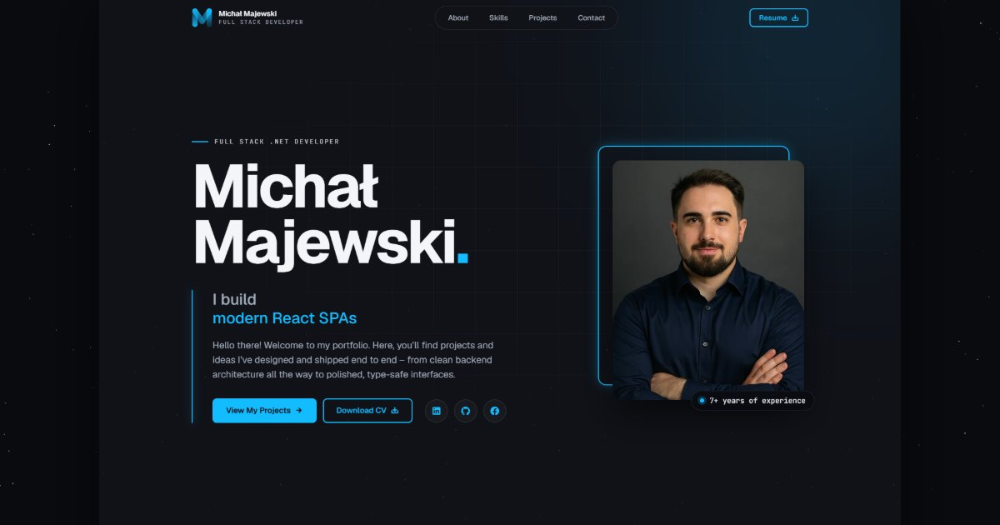

# Michał Majewski – Portfolio

Personal portfolio website of a Full Stack .NET & React developer: about me, skills, projects and a contact form.

**Live:** https://lemon-forest-0a1d05503.2.azurestaticapps.net

## Tech stack

- **React 18** + **TypeScript** (strict mode)
- **Vite 6**
- **Tailwind CSS 3** + SCSS
- **tsParticles** – animated background
- **EmailJS** – contact form without a custom backend
- **Azure Static Web Apps** + **GitHub Actions** – CI/CD

## Features

- Single-page layout with smooth scrolling and active section highlighting
- Responsive design: desktop navbar and mobile burger menu
- Project flip cards – hover on desktop, tap on smaller screens
- Contact form with client-side validation, delivered through EmailJS
- Downloadable CV

## Credits

Technology logos come from [Devicon](https://github.com/devicons/devicon) (MIT) and the [.NET brand repository](https://github.com/dotnet/brand) (CC0) – see `src/assets/tech/LICENSE.txt`.

## Contact

- [LinkedIn](https://www.linkedin.com/in/micha%C5%82-majewski-/)
- [GitHub](https://github.com/majowielki)
